## Hey there, Welcome to My Github 👋
I am a Software Engineering student @McMaster University, in Canada! 

My interests can be summed up in 2 words, "Ml + Software". I want to be part of discovering and translating innovations in Ml research into robust software to enrich our experiences!

When I'm not tinkering I love to play soccer ⚽, hike 🚵🏼, and travel 🗼(recently visited Japan!)

Also got twitter to keep up with advancements in ml and ~~ml drama~~, [@PodderGourob](https://twitter.com/PodderGourob) and am currently working on my first blog post 👀

💬 feel free to reach out on my [Linkedin](https://www.linkedin.com/in/gourobpodder/) or through email, gkpodder2003@gmail.com !

⚡ Work experience: 
*  Interned at RBC working with auto-regressive models on RISK tasks. Also did some swe work where I collobarated in designing and developing a fullstack application to connect our models to our clients seamlessly 
*  Interned at Hatch LTD. training large image segmentation models for manufacturing. Also built robust data pipelines on azure and deployed the application on the edge for real-time inference

🔭 Currently into: 
*  Large foundational models(both visual and language)
*  Ml systems(particularly in inference and training)
*  Parallel/Distributed Systems
*  Being a better person ❤️

<!--
**gkpodder/gkpodder** is a ✨ _special_ ✨ repository because its `README.md` (this file) appears on your GitHub profile.

Here are some ideas to get you started:

- 🔭 I’m currently working on ...
- 🌱 I’m currently learning ...
- 👯 I’m looking to collaborate on ...
- 🤔 I’m looking for help with ...
- 💬 Ask me about ...
- 📫 How to reach me: ...
- 😄 Pronouns: ...
- ⚡ Fun fact: ...
-->

